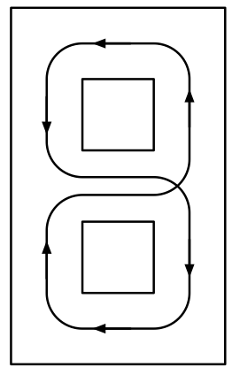

# Simulation de Comportement Réactif avec Réservoir Neuronal

Ce projet de stage a été réalisé par **Yves Appriou** au sein de l'équipe MNEMOSYNE à l’INRIA Bordeaux, sous la supervision de Nicolas Rougier. Il s’inscrit dans le prolongement des travaux présentés dans la thèse de Naomi Chaix Eichel ([HAL](https://theses.hal.science/tel-04849313)) et du code [splitter-cells](https://github.com/naomichx/splitter-cells).

## 🎯 Objectif

Le but du stage est de **reproduire et valider les résultats expérimentaux** de Naomi Chaix Eichel sur une tâche de navigation répétée dans un labyrinthe par un robot autonome.

Le robot, inspiré des **véhicules de Braitenberg**, est équipé d’un **réservoir de 1000 neurones**. Il doit parcourir un circuit en forme de boucle (type "8") en alternant les virages à gauche et à droite.  
L’entrée du modèle correspond aux valeurs des **capteurs de distance**, et la sortie est l’**angle de rotation** du robot (la vitesse est fixée à `2`).

 


Le simulateur utilisé est basé sur le projet [tiny-bot](https://github.com/rougier/tiny-bot).

## 📁 Structure du projet

Le code principal se trouve dans le dossier `propre/` :

| Fichier | Description |
|--------|-------------|
| `dataset_building.py` | Génère un fichier `.npy` contenant les données d'entraînement à partir des comportements du robot |
| `Reservoir_test.py` | Teste un ensemble d’hyperparamètres sur le jeu de données généré |
| `optimisation_reservoir.py` | Utilise `hyperopt` pour optimiser les hyperparamètres du réservoir neuronal |

## ⚙️ Exécution

1. Générer les données :
   ```bash
   python3 propre/dataset_building.py

2. tester le reservoir :
    ```bash
    python3 propre/reservoir_test.py

3. Lancer une recherche d'hyperparametres : 
    ```bash
    python3 propre/reservoir_optimisation.py
